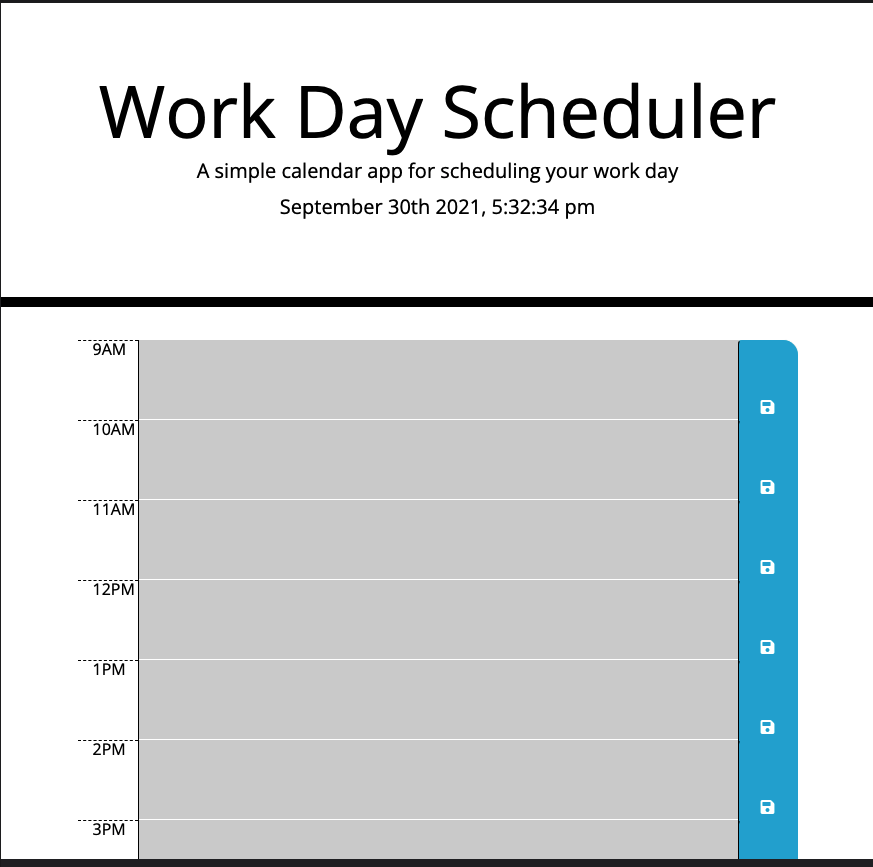

# work-day-scheduler

## Description 
This is a planner where users can type a task/event for a given time and the program will save the users input. 

## Installation 
- Clone repository or follow link to the launched application. 

## Instructions
- Enter task/event into any row. 
- Click the save button to save your input.
- The program will save the input. 

## Website
- https://mojikalani.github.io/work-day-scheduler/
- https://github.com/mojikalani/work-day-scheduler